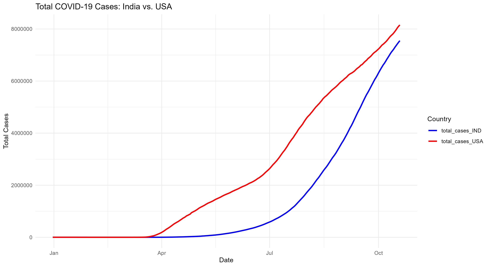
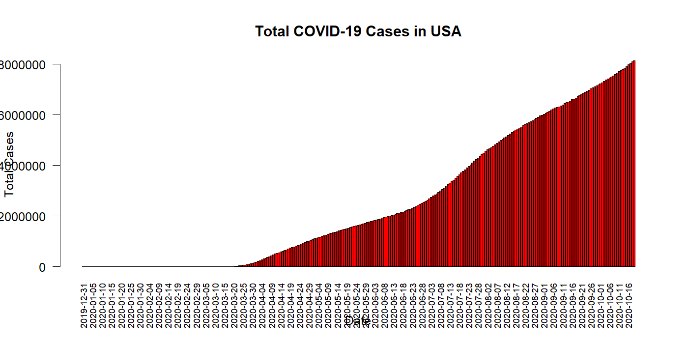
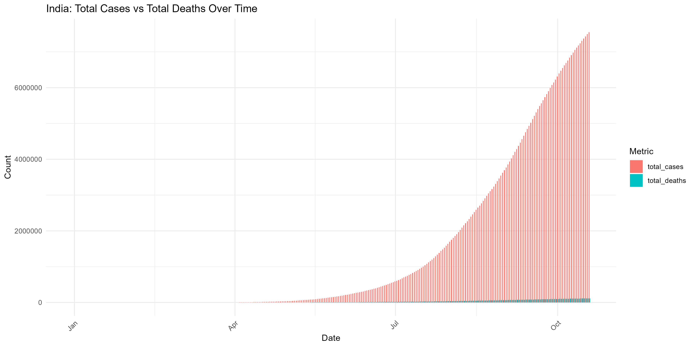
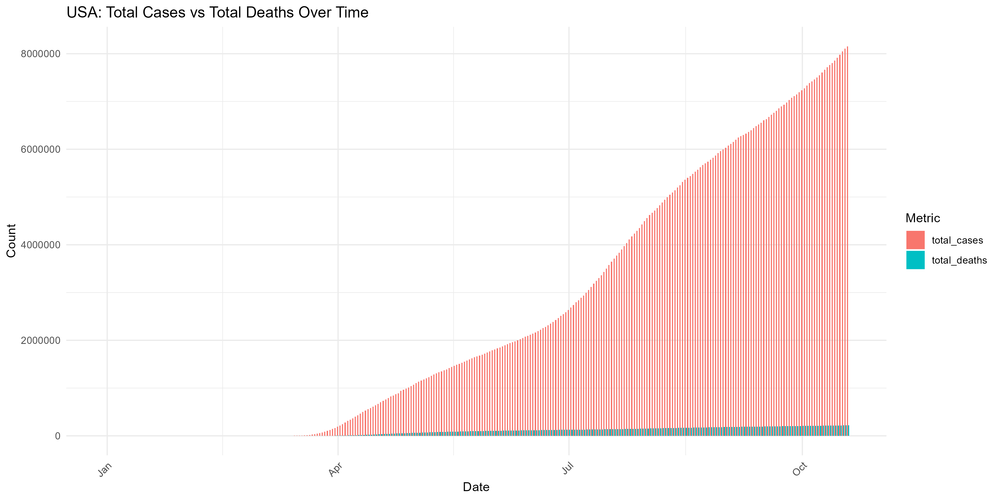
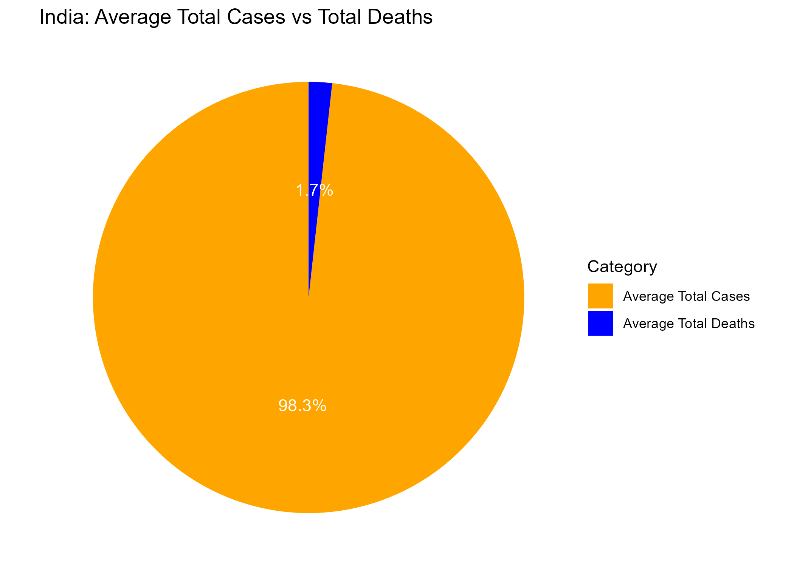
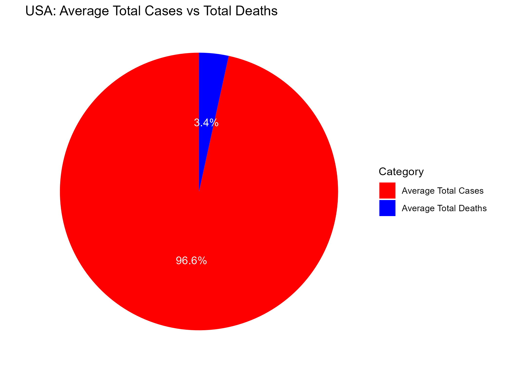
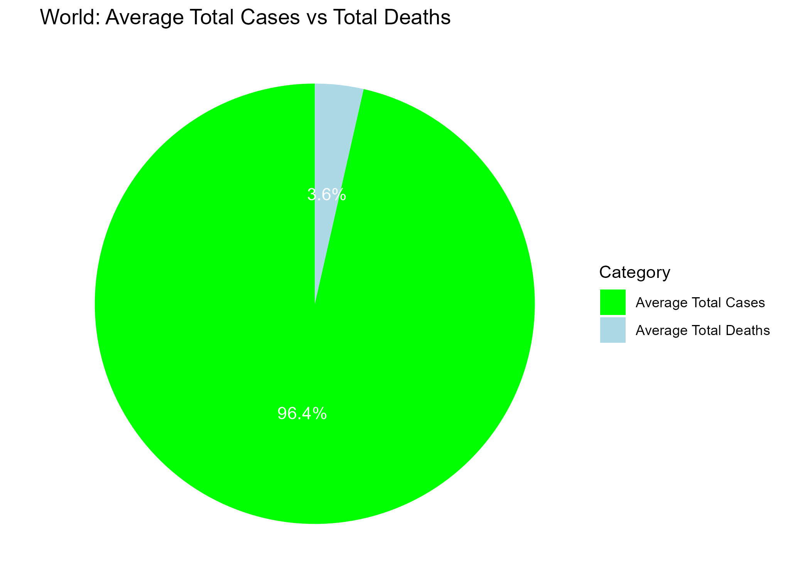

# COVID-19 Data Visualisation (R)

This repo contains an R project that cleans a COVID-19 dataset and generates visualisations saved into `plots/` (so they render nicely on GitHub).

## Project structure

- `BDA_Project.Rproj` — RStudio project
- `scripts/Project_github.R` — main script (creates plots + saves them)
- `scripts/packages_install.R` — optional helper to install required packages
- `data/` — put your dataset here as `data/raw_data.csv`
- `plots/` — generated figures (PNG)

## How to run

1. Put your dataset at: `data/raw_data.csv`
2. Open `BDA_Project.Rproj` in RStudio
3. Run:

```r
source("scripts/Project_github.R")
```

All images will be written to the `plots/` folder.

## Visualisations (auto-filled once you run the script)

### India vs USA total cases (line chart)


### India total cases (bar)


### USA total cases (bar)


### India cases vs deaths (bars)


### USA cases vs deaths (bars)


### India average cases vs deaths (pie)


### USA average cases vs deaths (pie)


### World average cases vs deaths (pie)


### Average GDP per capita by country (bar)

